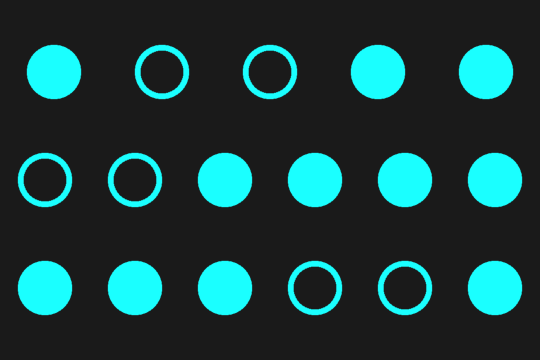
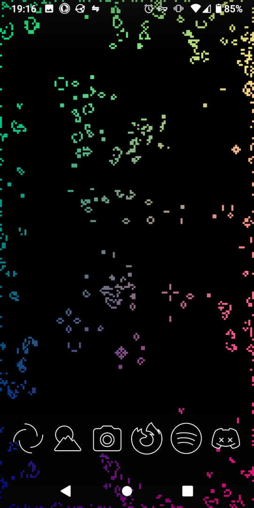

# android-shaders
GLSL shaders made in/for the [Shader Editor app](https://f-droid.org/en/packages/de.markusfisch.android.shadereditor/) on F-Droid ([source](https://github.com/markusfisch/ShaderEditor)).

### binary_clock.glsl
Displays hours, minutes and seconds in binary as rows of filled circles. The example below is showing the time `19:15:57`

### interactive_game_of_life
A rainbow-coloured simulation of [Conway's Game of Life](https://conwaylife.com/wiki/Conway%27s_Game_of_Life). The edges of the screen are randomised so that the pattern never stabilises. Pressing on the screen will turn on cells in a small radius.

