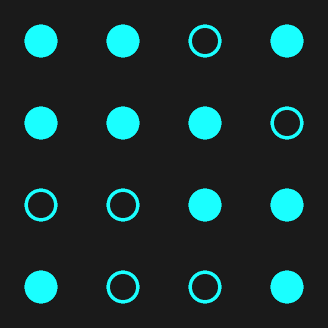

# android-shaders
GLSL shaders made in/for the [Shader Editor app](https://f-droid.org/en/packages/de.markusfisch.android.shadereditor/) on F-Droid ([source](https://github.com/markusfisch/ShaderEditor)).

### binary_clock.glsl
Displays hours, minutes and seconds in binary as rows of filled circles. The example below is showing the time `19:15:57`

### binary_clock_square.glsl
Divides the day into 65536 beats, roughly 1.3 seconds each, and displays the time in a 4x4 grid as binary. The least significant bit is to the bottom right, increasing left first then up.

The example below is showing the time `1101 1110 0011 1001` or `DE39`in hexadecimal (one digit per row of dots), which is equivalent to about `20:50:00`.

Formula for converting a time to beats: `(hours * 3600 + minutes * 60 + seconds) / 86400 * 65536`

And to convert back to hours, minutes and seconds:
- `seconds = int((beats * 86400 / 65536) % 60)`
- `minutes = int((beats * 86400 / 65536) / 60 % 60)`
- `hours   = int((beats * 86400 / 65536) / 3600)`

### interactive_game_of_life.glsl
A rainbow-coloured simulation of [Conway's Game of Life](https://conwaylife.com/wiki/Conway%27s_Game_of_Life). The edges of the screen are randomised so that the pattern never stabilises. Pressing on the screen will turn on cells in a small radius.

